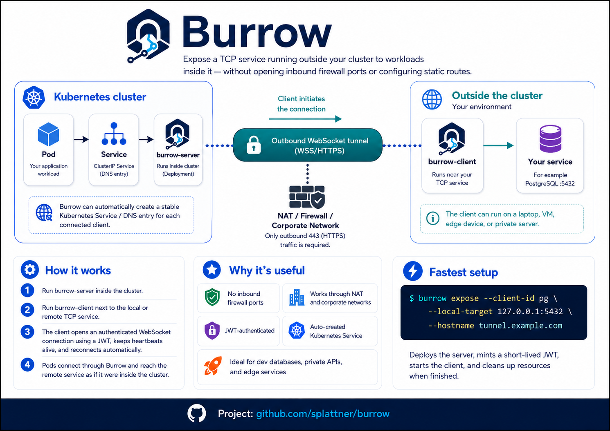

<p align="center">
  
</p>

# Burrow

Expose a TCP service running outside your cluster to workloads running inside it — without opening inbound firewall ports or configuring static routes.

The client runs wherever your service lives (laptop, edge node, private server). It dials outbound to a WebSocket endpoint on the server, which runs inside your cluster. Traffic from pods reaches your local service through that persistent tunnel connection. Because the client always initiates the connection, it works through NAT, firewalls, and most corporate networks.



The server optionally manages Kubernetes `Service` objects automatically — one per connected client — so pods can reach tunnelled services by a stable DNS name.

---

## Contents

- [How it works](#how-it-works)
- [Quick start (dev)](#quick-start-dev)
- [Deploying to Kubernetes](#deploying-to-kubernetes)
- [Running the client](#running-the-client)
- [Expose command](#expose-command)
- [Configuration reference](#configuration-reference)
- [Authentication](#authentication)
- [Building from source](#building-from-source)

---

## How it works

1. The **server** runs in-cluster and listens on two ports:
   - An HTTP/WebSocket port (default `:8080`) — clients connect here, pods call `/healthz` and `/metrics` here.
   - A TCP bridge port (default `:1111`) — pods that want to reach the tunnelled service connect here.

2. The **client** runs outside the cluster. On startup it:
   - Dials the server's WebSocket endpoint with a signed JWT as its bearer token.
   - Registers its `client_id` and the `local-target` address it will forward traffic to.
   - Keeps the connection alive with heartbeats and reconnects automatically on failure.

3. When a pod connects to the bridge port, the server opens a new multiplexed stream over the active WebSocket session and the client forwards it to the local target.

4. When the client disconnects the server cleans up its associated Kubernetes `Service` (if Kube API mode is enabled).

---

## Quick start (dev)

Requires Go 1.25+ and Python 3 (used by the token-minting helper script).

**1. Start the server with a shared HS256 secret:**

```bash
make run-server-jwt-dev JWT_HMAC_SECRET=dev-secret JWT_AUDIENCE=burrow-server JWT_ISSUER=dev-local
```

**2. In a second terminal, mint a token and start the client:**

```bash
make run-client-jwt-dev \
  CLIENT_ID=client-a \
  LOCAL_TARGET=127.0.0.1:5432 \
  JWT_HMAC_SECRET=dev-secret \
  JWT_AUDIENCE=burrow-server \
  JWT_ISSUER=dev-local
```

The client connects to `ws://127.0.0.1:8080/ws` by default. Traffic arriving at the server's bridge port (`:1111`) is forwarded to `127.0.0.1:5432` on the client machine.

**3. Test the tunnel:**

```bash
# Anything connecting to the bridge port reaches your local service
nc 127.0.0.1 1111
```

---

## Deploying to Kubernetes

Manifests are in `manifests/`. Apply them in order:

```bash
kubectl apply -f manifests/serviceaccount.yaml
kubectl apply -f manifests/role.yaml
kubectl apply -f manifests/rolebinding.yaml
kubectl apply -f manifests/deployment.yaml
kubectl apply -f manifests/service.yaml
kubectl apply -f manifests/ingress.yaml
```

Edit `manifests/deployment.yaml` before applying:

| Field | What to change |
|---|---|
| `image` | Your built image (`ghcr.io/yourorg/burrow:tag`) |
| `BURROW_JWT_HMAC_SECRET` | Replace `change-me` with a real secret, or switch to `BURROW_JWT_PUBLIC_KEY_FILE` / `BURROW_JWKS_URL` |
| `BURROW_JWT_AUDIENCE` | Match the audience your tokens are issued for |
| `BURROW_JWT_ISSUER` | Match your token issuer |
| `BURROW_NAMESPACE` | Namespace where client `Service` objects are created |

Edit `manifests/ingress.yaml`:

- Set `spec.rules[0].host` to your actual domain.
- The ingress must support long-lived connections — the nginx annotations set `proxy-read-timeout` and `proxy-send-timeout` to `3600s`.

### Production JWT configuration

For production, use RS256 or ES256 with a JWKS endpoint instead of a shared secret:

```yaml
- name: BURROW_JWT_ALG
  value: "RS256"
- name: BURROW_JWKS_URL
  value: "https://your-idp.example/.well-known/jwks.json"
- name: BURROW_JWT_AUDIENCE
  value: "burrow-server"
- name: BURROW_JWT_ISSUER
  value: "https://your-idp.example"
```

Remove the `BURROW_JWT_HMAC_SECRET` entry when using JWKS.

---

## Running the client

The client binary runs wherever you want to expose a service from. Download a release binary or [build from source](#building-from-source).

### Minimal example

```bash
burrow client \
  --bearer-token "$JWT" \
  --server-url wss://burrow.example.com/ws \
  --client-id my-service \
  --local-target 127.0.0.1:5432
```

### Using a token file (recommended for long-running clients)

Token files are re-read on every reconnect, so token rotation requires no restart:

```bash
burrow client \
  --bearer-token-file /var/run/secrets/burrow/token.jwt \
  --server-url wss://burrow.example.com/ws \
  --client-id my-service \
  --local-target 127.0.0.1:5432
```

The client reconnects proactively before the token expires (controlled by `--token-refresh-window`).

### Makefile helpers

```bash
# Inline token
make run-client BEARER_TOKEN="$JWT" CLIENT_ID=my-service LOCAL_TARGET=127.0.0.1:5432

# Token file with custom refresh window
make run-client BEARER_TOKEN_FILE=/var/run/burrow/token.jwt CLIENT_ID=my-service LOCAL_TARGET=127.0.0.1:5432 TOKEN_REFRESH_WINDOW=45s

# Production server (JWKS)
make run-server JWKS_URL=https://idp.example/.well-known/jwks.json JWT_AUDIENCE=burrow-server
```

---

## Expose command

`burrow expose` is a one-shot command that:

1. Deploys the burrow server to Kubernetes (ServiceAccount, Role, RoleBinding, Deployment, Service, and optionally Ingress).
2. Generates an ephemeral HS256 key, stores it in a Kubernetes Secret, and mints a short-lived JWT for the client.
3. Starts the burrow client locally and connects it to the deployed server, forming the complete tunnel.
4. Cleans up all Kubernetes resources when the tunnel exits (unless `--keep` is set).

This is the fastest way to set up a tunnel without managing manifests manually.

### Modes

| Mode | When | Server URL |
|---|---|---|
| **Ingress** | `--hostname` is set | `wss://<hostname>/ws` |
| **LoadBalancer** | `--hostname` not set | `ws://<lb-ip>:<server-port>/ws` |

### Quick examples

```bash
# Expose a local PostgreSQL via Ingress (TLS, WebSocket-ready nginx annotations included)
burrow expose \
  --client-id pg \
  --local-target 127.0.0.1:5432 \
  --hostname tunnel.example.com

# Expose via LoadBalancer (no Ingress needed)
burrow expose \
  --client-id api \
  --local-target 127.0.0.1:8080

# Preview what Kubernetes resources would be created without deploying
burrow expose --client-id api --dry-run

# Keep server resources after the tunnel closes (reconnect later with --reuse)
burrow expose --client-id api --local-target 127.0.0.1:8080 --keep

# Reconnect to a previously kept deployment
burrow expose --client-id api --local-target 127.0.0.1:8080 --reuse

# Delete a kept deployment
burrow expose delete --client-id api
```

### Kubernetes resources created

| Resource | Purpose |
|---|---|
| `Secret burrow-<id>-auth` | Ephemeral HS256 key used to sign the client JWT |
| `ServiceAccount burrow-<id>` | Identity for the server Pod |
| `Role burrow-<id>` | Grants CRUD on `services` in the namespace |
| `RoleBinding burrow-<id>` | Binds the Role to the ServiceAccount |
| `Deployment burrow-<id>` | Runs the burrow server Pod |
| `Service burrow-<id>` | ClusterIP (Ingress mode) or LoadBalancer |
| `Ingress burrow-<id>` | Routes external HTTPS traffic to the server (Ingress mode only) |

All resources share the labels `app.kubernetes.io/managed-by=burrow` and `burrow.dev/client-id=<id>`.

### Customising with `--patch-*`

The `--patch-deployment`, `--patch-service`, and `--patch-ingress` flags accept a JSON [strategic merge patch](https://kubernetes.io/docs/tasks/manage-kubernetes-objects/update-api-object-kubectl-patch/) applied to the respective resource before creation.

```bash
# Add resource requests and limits
burrow expose --client-id api --local-target 127.0.0.1:8080 \
  --patch-deployment '{"spec":{"template":{"spec":{"containers":[{"name":"server","resources":{"requests":{"cpu":"50m","memory":"64Mi"},"limits":{"cpu":"200m","memory":"128Mi"}}}]}}}}'

# Enforce a non-root, read-only container
burrow expose --client-id api --local-target 127.0.0.1:8080 \
  --patch-deployment '{"spec":{"template":{"spec":{"securityContext":{"runAsNonRoot":true,"runAsUser":65534},"containers":[{"name":"server","securityContext":{"allowPrivilegeEscalation":false,"readOnlyRootFilesystem":true,"capabilities":{"drop":["ALL"]}}}]}}}}'
```

### Expose flags

| Flag | Default | Description |
|---|---|---|
| `--client-id` | — | Unique identifier for this session (required) |
| `--local-target` | — | Local `host:port` to forward tunnel traffic to (required unless `--dry-run`) |
| `--hostname` | — | Ingress hostname; omit for LoadBalancer mode |
| `--tls-secret` | — | TLS Secret name for Ingress; omit to use the controller's default cert |
| `--ingress-class` | auto-detect | IngressClass name |
| `--ingress-annotation` | — | Extra Ingress annotation in `key=value` format (repeatable) |
| `--image` | `ghcr.io/splattner/burrow:<version>` | Container image for the server |
| `--server-port` | `8080` | Port the server listens on inside the container |
| `--bridge-port` | `1111` | Port the bridge listener uses inside the container |
| `--namespace` | context default | Kubernetes namespace |
| `--kube-context` | current context | Kubernetes context |
| `--reuse` | false | Connect to an existing burrow deployment instead of creating one |
| `--keep` | false | Leave server resources in Kubernetes after the tunnel closes |
| `--wait-timeout` | `2m` | Maximum time to wait for the server to become available |
| `--dry-run` | false | Print Kubernetes resources without deploying |
| `--patch-deployment` | — | JSON strategic merge patch for the Deployment |
| `--patch-service` | — | JSON strategic merge patch for the Service |
| `--patch-ingress` | — | JSON strategic merge patch for the Ingress |

---

## Configuration reference

All flags can be set via environment variables with the `BURROW_` prefix. Flags take precedence over environment variables.

### Server

| Flag | Env var | Default | Description |
|---|---|---|---|
| `--jwt-alg` | `BURROW_JWT_ALG` | `RS256` | JWT signing algorithm |
| `--jwt-hmac-secret` | `BURROW_JWT_HMAC_SECRET` | — | HMAC secret for HS256/HS384/HS512 (dev/test) |
| `--jwt-public-key-file` | `BURROW_JWT_PUBLIC_KEY_FILE` | — | Path to PEM public key for RS256/ES256 |
| `--jwks-url` | `BURROW_JWKS_URL` | — | JWKS endpoint URL; keys resolved by `kid` |
| `--jwks-refresh` | `BURROW_JWKS_REFRESH` | `5m` | How often to refresh JWKS keys |
| `--jwt-issuer` | `BURROW_JWT_ISSUER` | — | Expected `iss` claim (optional) |
| `--jwt-audience` | `BURROW_JWT_AUDIENCE` | — | Expected `aud` claim (optional) |
| `--server-addr` | `BURROW_SERVER_ADDR` | `:8080` | WebSocket and HTTP listen address |
| `--bridge-host` | `BURROW_BRIDGE_HOST` | — | Host to bind per-client bridge listeners on (each client gets a random port) |
| `--namespace` | `BURROW_NAMESPACE` | `default` | Namespace for auto-created client Services |
| `--enable-kube-api` | `BURROW_ENABLE_KUBE_API` | auto | Force Kubernetes Service reconciliation on (`true`) or off (`false`) |
| `--heartbeat-interval` | `BURROW_HEARTBEAT_INTERVAL` | `10s` | How often to send heartbeats |
| `--heartbeat-timeout` | `BURROW_HEARTBEAT_TIMEOUT` | `30s` | Disconnect client if no heartbeat within this window |
| `--sweep-interval` | `BURROW_SWEEP_INTERVAL` | `1m` | How often to check for stale disconnected Services |
| `--stale-service-age` | `BURROW_STALE_SERVICE_AGE` | `10m` | Delete a disconnected client's Service after this duration |
| `--log-level` | `BURROW_LOG_LEVEL` | `info` | Log verbosity: `debug`, `info`, `warn`, `error` |

### Client

| Flag | Env var | Default | Description |
|---|---|---|---|
| `--bearer-token` | `BURROW_BEARER_TOKEN` | — | JWT to send as the bearer token |
| `--bearer-token-file` | `BURROW_BEARER_TOKEN_FILE` | — | File path to read the JWT from (re-read on reconnect) |
| `--server-url` | `BURROW_SERVER_URL` | — | Server WebSocket URL, e.g. `wss://burrow.example.com/ws` |
| `--client-id` | `BURROW_CLIENT_ID` | — | Unique identifier for this client; must match JWT `sub` |
| `--local-target` | `BURROW_LOCAL_TARGET` | — | Local `host:port` to forward traffic to |
| `--token-refresh-window` | `BURROW_TOKEN_REFRESH_WINDOW` | `30s` | Reconnect this long before the token expires |
| `--client-retry-interval` | `BURROW_CLIENT_RETRY_INTERVAL` | `1s` | Base backoff interval for transport failures |
| `--client-auth-retry-interval` | `BURROW_CLIENT_AUTH_RETRY_INTERVAL` | `5s` | Base backoff interval for auth failures |
| `--log-level` | `BURROW_LOG_LEVEL` | `info` | Log verbosity: `debug`, `info`, `warn`, `error` |

---

## Authentication

The server accepts JWT bearer tokens only. The token is sent by the client in the WebSocket upgrade request as `Authorization: Bearer <token>`.

### Identity binding

The JWT `sub` claim must equal the `--client-id` the client registers with. If they differ, the server rejects the connection immediately.

### Supported key sources

Configure exactly one of:

| Option | When to use |
|---|---|
| `--jwt-hmac-secret` | Development and testing only |
| `--jwt-public-key-file` | Static asymmetric key (RS256, ES256) |
| `--jwks-url` | Production; keys rotated without server restart |

### Token rotation

When using `--bearer-token-file`, the client reads the file on every reconnect. Combined with `--token-refresh-window`, the client proactively reconnects before expiry and picks up the new token automatically, making rotation seamless.

---

## Container images

Images are published to the GitHub Container Registry at `ghcr.io/splattner/burrow`.

| Tag | Description |
|---|---|
| `latest` | Most recent stable release |
| `v1.2.3` | Specific release version |
| `edge` | Latest commit on `main` (may be unstable) |
| `sha-abc1234` | Pinned to a specific commit |

```bash
# Pull the latest stable release
docker pull ghcr.io/splattner/burrow:latest

# Pull a specific version
docker pull ghcr.io/splattner/burrow:v1.2.3

# Pull the latest development build
docker pull ghcr.io/splattner/burrow:edge
```

Release images are signed with [Sigstore cosign](https://docs.sigstore.dev/cosign/overview/) using keyless signing. Verify a release image:

```bash
cosign verify ghcr.io/splattner/burrow:latest \
  --certificate-identity-regexp="https://github.com/splattner/burrow/" \
  --certificate-oidc-issuer="https://token.actions.githubusercontent.com"
```

SBOM files (CycloneDX/SPDX) are attached to each [GitHub release](https://github.com/splattner/burrow/releases) as release assets.

---

## Building from source

Requires Go 1.25+.

```bash
# Build the binary
make build
# Output: bin/burrow

# Run tests
make test

# Run the local end-to-end smoke test
make e2e-smoke
```

The smoke test (`test/e2e/smoke.sh`) starts a local echo server, a server process, and a client process, then verifies the full data path, health endpoints, and reconnect behavior. Logs are written to `/tmp/burrow-e2e-*.log`.
